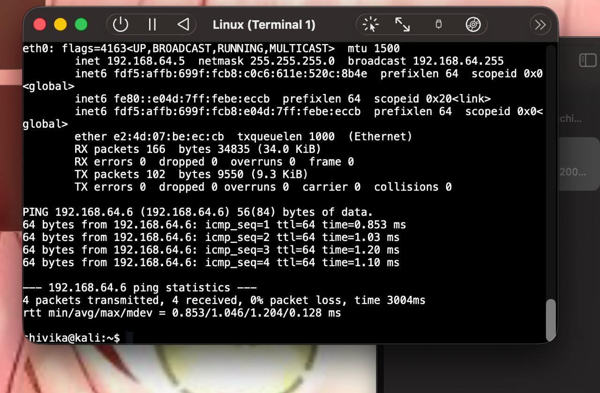
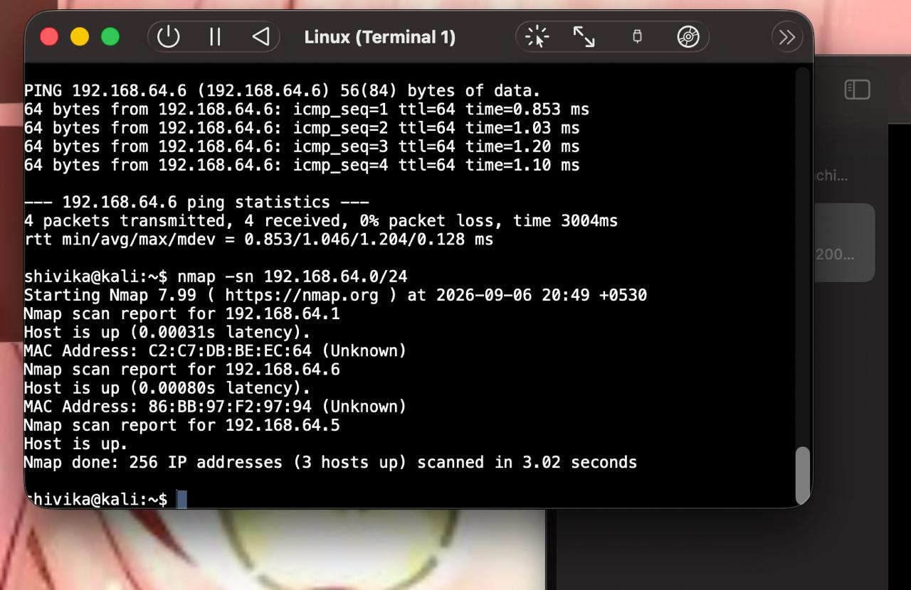
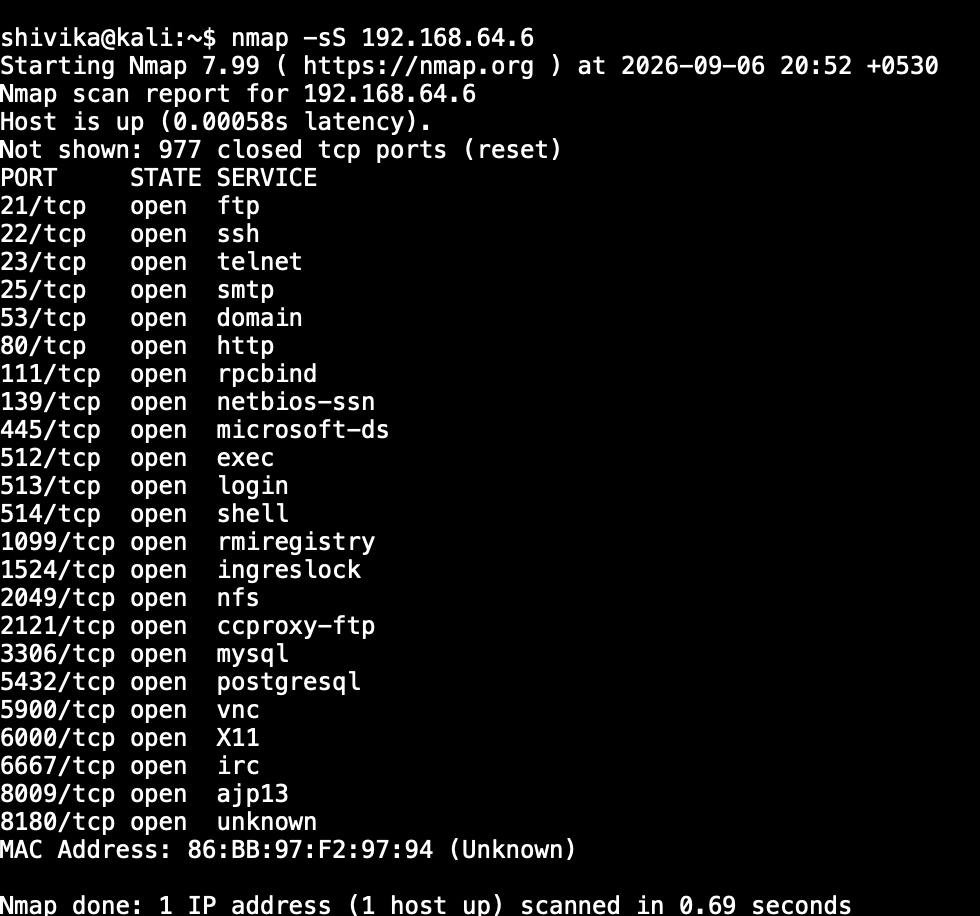
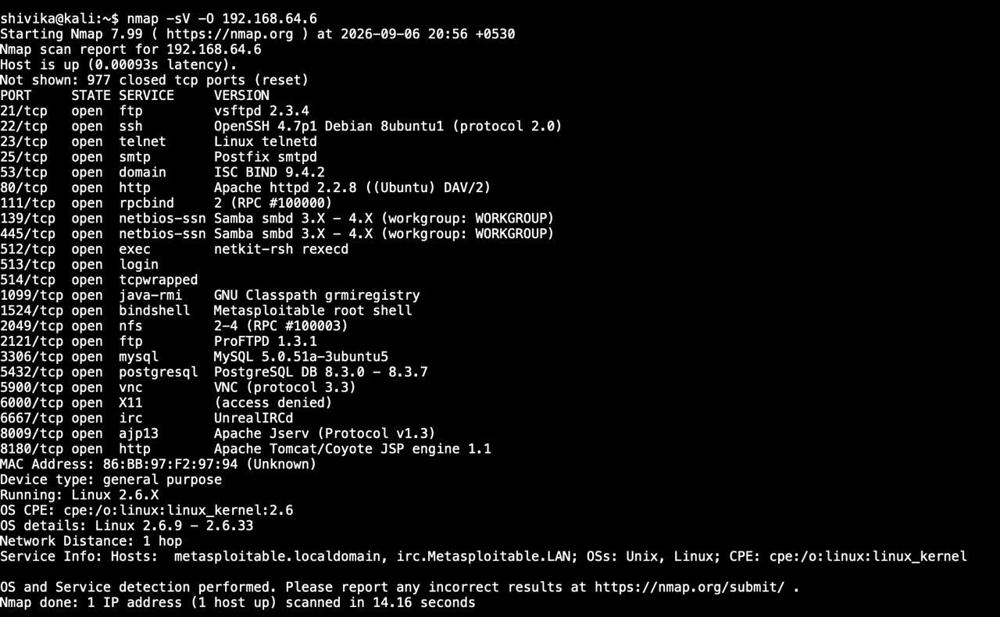
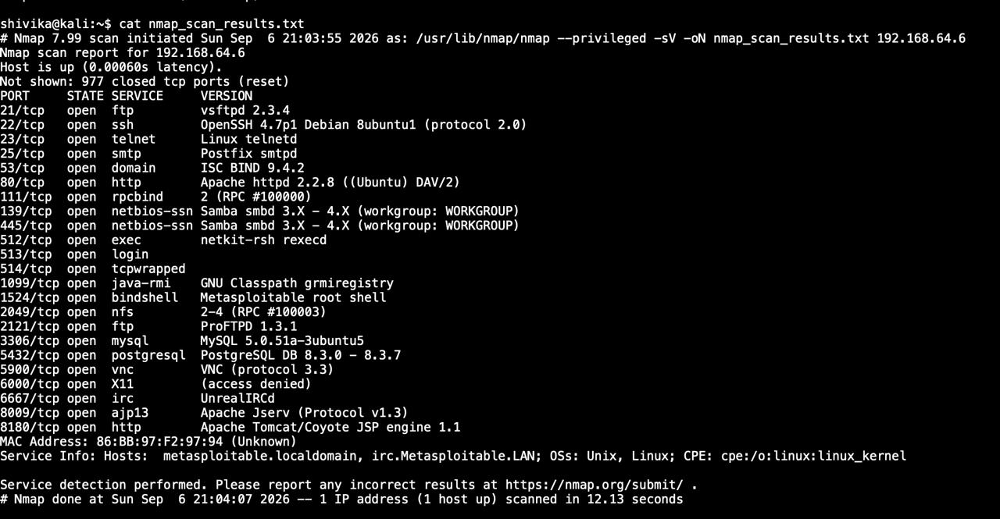
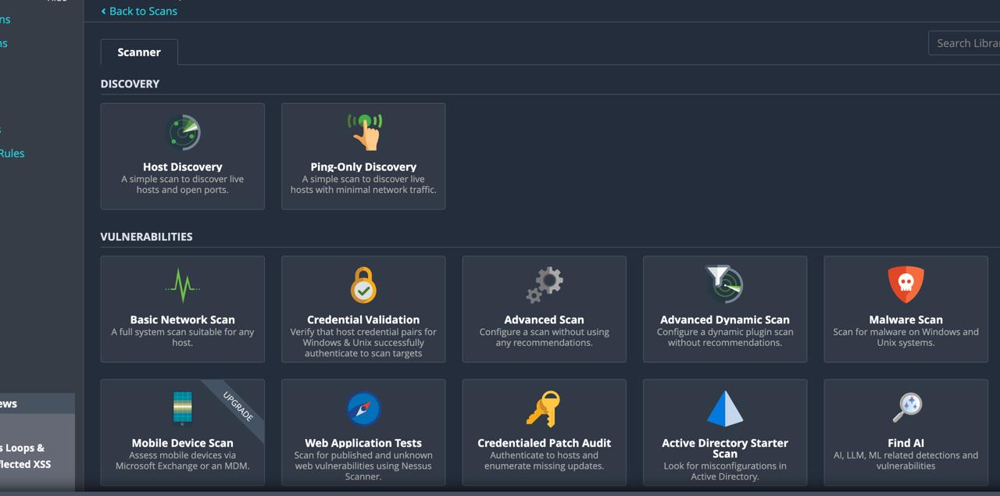
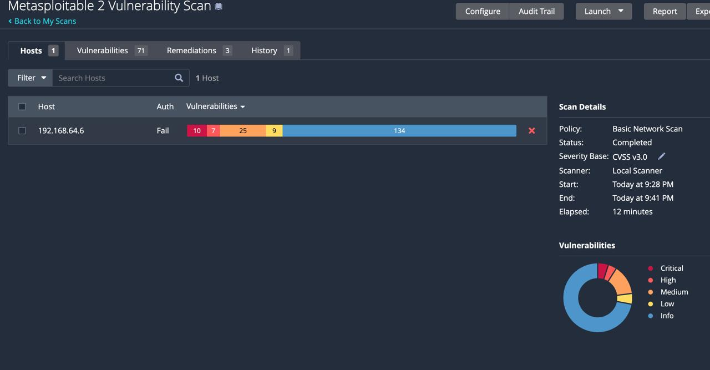
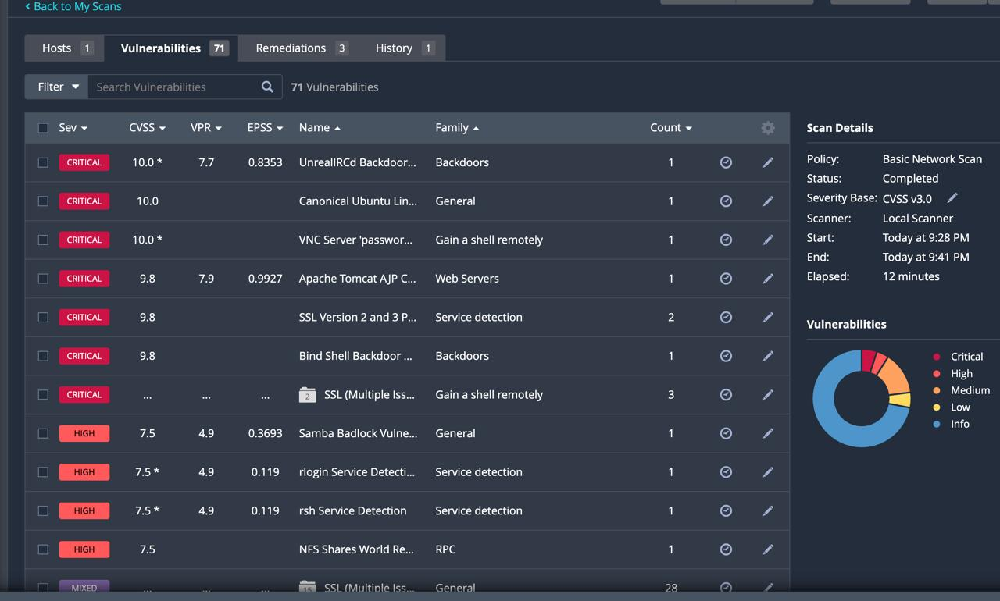
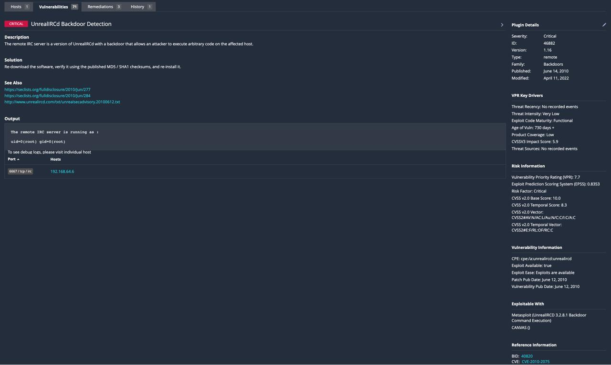

# Experiment 1: Scanning for Vulnerabilities using Nmap and Nessus

## Objective

To identify active hosts and open ports using Nmap and detect known vulnerabilities using Nessus.

## Procedure

### Step 1: Identify your attacker machine's IP

Kali Linux IP was identified using `ifconfig`. Connectivity with the target was verified using:

ifconfig
ping -c 4 192.168.64.6

Kali IP: `192.168.64.5`  
Target IP: `192.168.64.6`

Ping was successful with 0% packet loss.

### Step 2: Discover live hosts

Live hosts were discovered using:

nmap -sn 192.168.64.0/24

### Step 3: Scan open ports

Open ports of the target were identified using:

nmap -sS 192.168.64.6

### Step 4: Service & OS Detection

Service versions and OS information were obtained using:

nmap -sV -O 192.168.64.6

### Step 5: Save Scan Results

The Nmap results were saved using:

nmap -sV -oN nmap_scan_results.txt 192.168.64.6

The file was verified using:

cat nmap_scan_results.txt

### Step 6: Create Nessus Scan

Nessus Essentials was opened and Basic Network Scan was selected.

### Step 7: Configure & Launch Scan

A scan named `Metasploitable 2 Vulnerability Scan` was created with target `192.168.64.6`.

The scan was launched and completed successfully.

### Step 8: Review Vulnerabilities

Nessus identified vulnerabilities categorized as Critical, High, Medium, Low and Informational.

### Step 9: Document Key Finding

One critical finding was examined:

- **Vulnerability:** UnrealIRCd Backdoor Detection
- **CVE:** CVE-2010-2075
- **Port:** 6667/tcp
- **Host:** 192.168.64.6
- **Solution:** Re-download, verify and reinstall the software.

