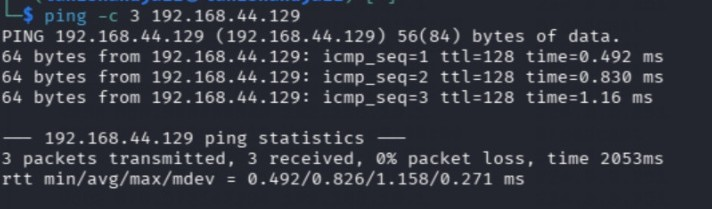
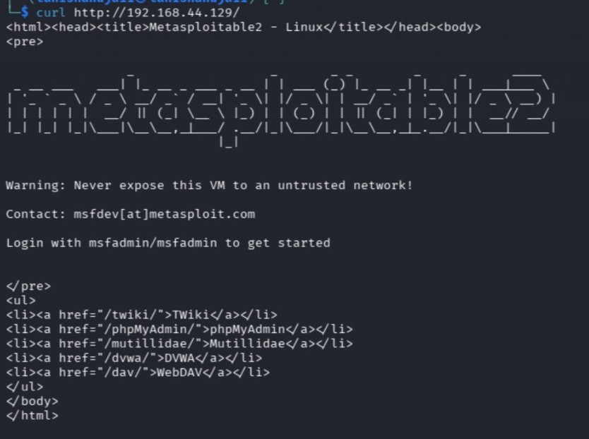
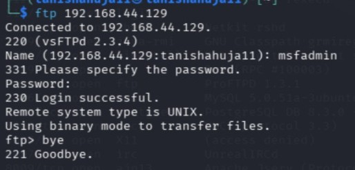
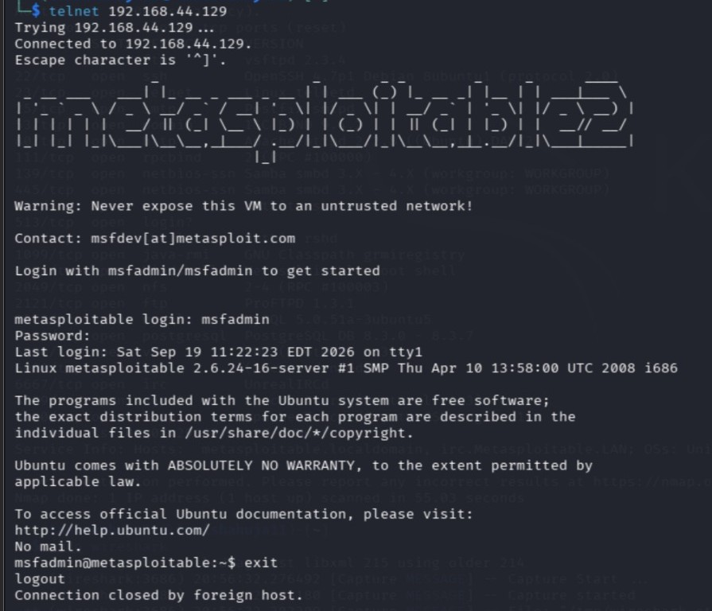
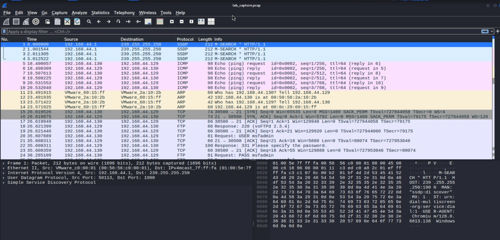
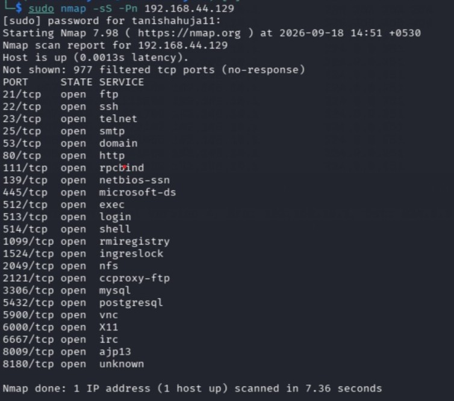

# Experiment No. 3

## Basic Network Traffic Analysis with Wireshark

### Aim

To capture and analyze network packets using Wireshark to identify network traffic and detect suspicious or cleartext information in a simulated network.

### Requirements

1. Kali Linux
2. Wireshark
3. Metasploitable 2
4. VirtualBox/VMware
5. Host-Only Adapter/Internal Network

### Theory

Wireshark is a network protocol analyzer used to capture and examine network packets. It helps in understanding network communication, identifying protocols, analyzing packet contents, and detecting suspicious network activity. In this experiment, Wireshark is used in a controlled lab environment to capture and analyze network traffic between virtual machines.

## Procedure

Step 1: Verify Connectivity

First, verify connectivity between Kali Linux and the Metasploitable 2 machine using:

ping -c 3 192.168.56.101

A successful reply confirms that Kali Linux can communicate with the target machine.

Step 2: Quick Port/Service Scan

Perform a quick port and service scan of the target using Nmap:

sudo nmap -sS -Pn 192.168.56.101

Observe the open ports and services identified on the target machine.

Step 3: Start Wireshark Capture

Open Wireshark in Kali Linux and select the network interface connected to the lab network, such as eth0 or ens33.

Start the packet capture and capture live network traffic.

Step 4: Generate Lab Traffic

While Wireshark is capturing packets, generate network traffic from Kali Linux.

HTTP GET
curl http://192.168.56.101/
FTP Login
ftp 192.168.56.101
Telnet Login
telnet 192.168.56.101

Run the interactions while Wireshark is capturing the traffic.

Step 5: Find Plaintext Information in Wireshark

Use the following Wireshark display filters to analyze the captured traffic.

Traffic to/from target
ip.addr == 192.168.56.101
FTP commands/credentials
ftp.request.command == "USER" || ftp.request.command == "PASS"
Telnet traffic
telnet
HTTP traffic
http
HTTP Basic Authentication
http.authorization

Select the relevant packet and use:

Right Click → Follow → TCP Stream

to examine the communication.

Step 6: Save Capture and Export Evidence

Save the captured traffic in Wireshark using:

File → Save As

Save the capture as:

lab_capture.pcap

The captured file can be kept as evidence for the lab report.

Result

The network traffic was successfully captured and analyzed using Wireshark. HTTP, FTP, Telnet and other network traffic were observed and examined in the controlled lab environment.

Conclusion

The experiment demonstrated the use of Wireshark for capturing and analyzing network traffic and examining protocol communication and cleartext information in a controlled environment.
